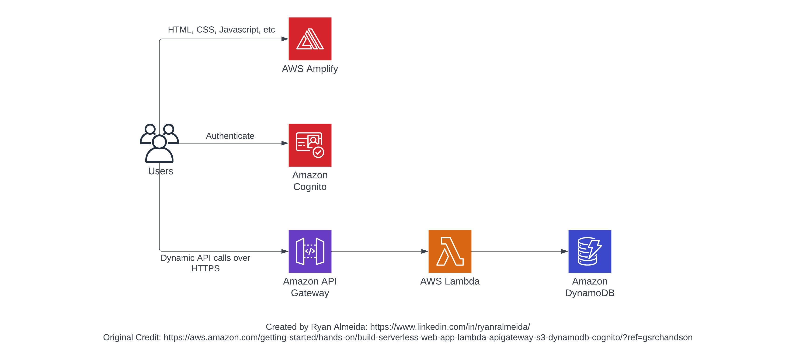

# Build a Serverless Web Application

## Create a simple serverless web application that enables users to request unicorn rides from the Wild Rydes fleet. A great project to learn serverless architecture 

This project is an example that was built along with a tutorial series from AWS (https://aws.amazon.com/getting-started/hands-on/build-serverless-web-app-lambda-apigateway-s3-dynamodb-cognito/) that teaches you how to build a simple serverless web application. The papplication encompasses several web concepts, such as creating an HTML based user interface, interacting with a RESTful web service, and providing facilities for users to register with the service.

This is a great project to familiarize yourself with serverless and web deployment services in AWS such as AWS Lambda, API Gateway, DynamoDB, Cognito and Amplify. The static website will also include HTML, CSS, and JavaScript. In particular, this project shows how to do the following:

- Configure AWS Amplify to host static resources for the web application (with continuous deplyment built in)
- Creating a Cognito user pool to manage user's accounts
- Build a backend process for handling requests for the web application by creating a Lambda function
- Deploying a RESTful API by using API Gateway to expose the Lambda function built in the previous step

## Architectural Diagram:

## Learning Outcomes

- Creating this particular beginner project in AWS to explore serverless computing offers valuable cloud skills. By configuring AWS Amplify for hosting static resources, you gain experience in setting up and managing a scalable and secure infrastructure for web applications. 
- Leveraging Cognito user pools helps you understand the process of user authentication and managing user accounts in a serverless environment. 
- Building a Lambda function for backend processing familiarizes you with serverless functions, event triggers, and serverless architectures. 
- Lastly, deploying a RESTful API using API Gateway enables you to expose your Lambda function and learn about API management and security. 
- By completing this project, I was able to gain practical knowledge in serverless computing, application deployment, authentication, and API development, all of which are valuable skills in the cloud computing landscape